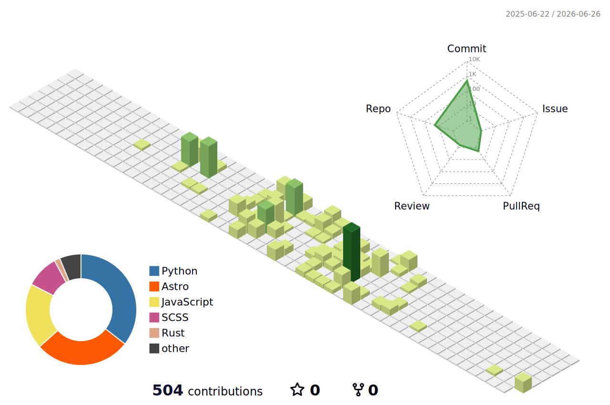

<!--
  Add your content under each "# ..." marker.
  The 3D contribution graph is generated by .github/workflows/profile-3d.yml.
-->

   
  <h1>Introduction</h1>
  <!-- # Introduction -->
   
   

---

  <!-- # Website -->
  
  <!-- # GitHub -->
  
  <!-- # Velog -->
  
  <!-- # Naver Blog -->
  

---

## Education
<!-- # Education -->
-  B.S. in Architectural Engineering, Seoul National University of Science and Technology (2020-2025)
-  M.S. in Civil and Environmental Engineering, Yonsei University (2026-present)
 

## External Education
<!-- # External Education -->
- 2024.06-2024.08 스마트 건설산업 전문인력 양성과정(건축•토목)
- 2025.08-2026.02 [HDC Labs] 생성형 AI활용 스마트 IoT 분석 및 서비스 개발 과정

 

---

## Current Research Task
<!-- # Current Research Task -->
- Cross-Document Information Consistency Verification for Construction Progress Payment Documents
- Comparative Evaluation of RDF-Based Ontology Representation Methods for Semantic Structuring of Construction Progress Payment Documents
- Development of an Automated Framework for Construction Progress Payment Document Generation
- Development of a Knowledge Graph-Based Framework for Automated Construction Schedule Management
[Keywords] Construction AI | Construction Documents | Progress Payment | Document Automation | Information Consistency | Ontology

 

## Paper/Publication
<!-- # Paper/Publication -->

 

---

  <h2>Github Contribution</h2>
  <!-- # Contribution 3D -->
  

---

## Backjoon
<!-- # Backjoon -->

  

 

## Language
<!-- # Language -->

  

 

---

## Tech stack
<!-- # Tech Stack -->

  
<strong>Languages</strong>

  
  
  

  
<strong>Data</strong>

  

  
<strong>BIM / CAD</strong>

  
  
  
  
  
  

  
<strong>Visualization</strong>

  
  

  
<strong>Simulation / Analysis</strong>

  
  
  

  
<strong>Collaboration / Ops</strong>

  
  
  
  

  
<strong>OS / Environments</strong>

  
  
  

 

## Certification
<!-- # Certification -->
